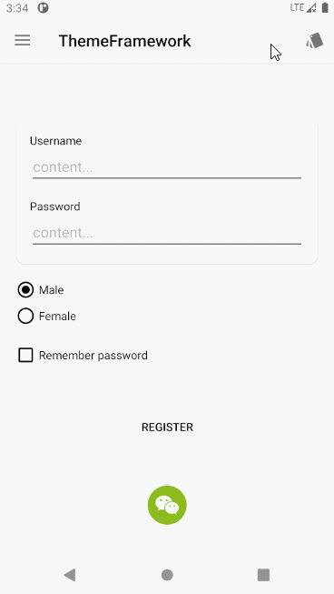
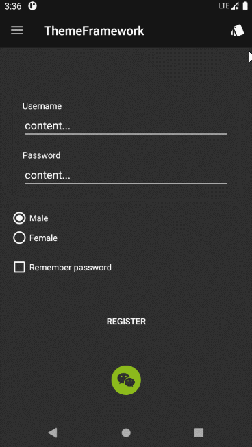
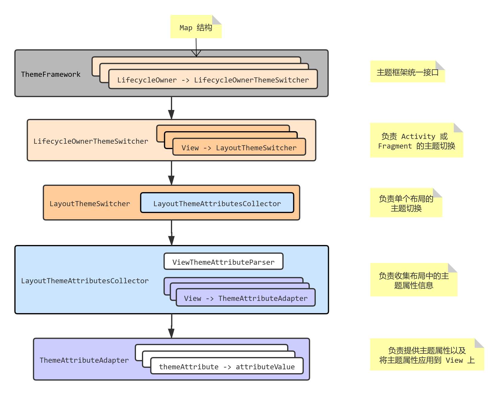

# ThemeFramework

- [主要特点](#主要特点)
- [快速开始](#快速开始)
- [常用方法](#常用方法)
  - [Fragmet](#fragmet)
  - [Dialog](#dialog)
  - [ListView 和 RecyclerView](#listview-和-recyclerview)
  - [动态添加 View](#动态添加-view)
  - [主题切换事件监听](#主题切换事件监听)
  - [单个 View 主题设置监听](#单个-view-主题设置监听)
- [扩展支持的 View 类型](#扩展支持的-view-类型)
- [View 类型支持情况](#view-类型支持情况)
- [架构](#架构)
- [实现思路和原理](#实现思路和原理)
  - [主题切换实现](#主题切换实现)
  - [实时切换主题的场景](#实时切换主题的场景)
  - [确定方案](#确定方案)
  - [核心实现](#核心实现)
- [LICENSE](#license)


Android 即时主题切换框架

核心是基于属性（attrs.xml 中配置）可根据所属主题（themes.xml 中配置）的不同，获得每种主题下的对应资源。

使用形式是在布局中配置对应的主题属性，然后一行代码一键切换主题。






PS：

欢迎小伙伴们提出建议和贡献代码。


# 主要特点

1. 低侵入性，不提供强制使用的控件

只提供主题属性以供布局中配置，可通过正则表达式搜索然后批量移除，不移除也不会对程序逻辑造成任何影响。


2. 高扩展性，易于支持新的 View

只需提供自定义主题属性和将属性资源设置给 View 的逻辑，以框架开发者和框架使用者的角度对支持的 View 类型进行扩展均非常方便。


要求：

必须使用 androidx 提供的 `AppCompatActivity` 和 `Fragment`（几乎是 Android 开发必选项），因为它们都是 `LifecycleOwner` 的实现类，框架可以方便的监听组件的生命周期，便于在组件销毁时自动释放资源，避免使用者手动处理资源。


待优化：

1. 提供的主题属性 Android Studio 不会自动提示，目前主题属性的命名是在对应 View 的原始属性之前添加 `tf_` 前缀，所以较易书写；
2. 主题属性在 Android Framework 提供的原生控件标签中会报红，因为 Android Studio 认为主题属性并非控件本身属性，虽然不影响编译，但是会令人不舒服。例如：

```xml
<Button
  android:layout_width="match_parent"
  android:layout_height="wrap_content"
  android:background="?attr/selectableItemBackground"
  android:textColor="?attr/appTextColor"
  app:tf_background="selectableItemBackground"
  app:tf_textColor="appTextColor" />
  <!-- 最后两行 IDE 会显示红色 -->
```

建议解决办法：

1. 使用相应的 `androidx.appcompat.widget.AppCompatXXX` 组件替代，就不会报红了，因为 Android Studio 认为 androidx Android Studio 允许使用未知属性。目前几乎所有的控件都有对应的 androidx 兼容性组件，除了 ListView、ProgressBar 零星组件；

```xml
<androidx.appcompat.widget.AppCompatButton
  android:layout_width="match_parent"
  android:layout_height="wrap_content"
  android:background="?attr/selectableItemBackground"
  android:textColor="?attr/appTextColor"
  app:tf_background="selectableItemBackground"
  app:tf_textColor="appTextColor" />
```

2. 或者加入 `tools:ignore="MissingPrefix"` 属性即可去除警告。

```xml
<Button
  android:layout_width="match_parent"
  android:layout_height="wrap_content"
  android:background="?attr/selectableItemBackground"
  android:textColor="?attr/appTextColor"
  app:tf_background="selectableItemBackground"
  app:tf_textColor="appTextColor" 
  tools:ignore="MissingPrefix" />
```


# 快速开始

1. 定义应用主题和主题属性

首先确定你的应用支持几种主题，例如支持白天主题和夜间主题，那么需要准备这两种主题所需的主题资源，通常是 color 和 drawable 资源。

例如，提供字体颜色和设置图标两个主题资源，那么首先在 attrs.xml 中自定义主题资源属性：

```xml
<!-- attrs.xml -->

<!-- 字体颜色，color 类型 -->
<attr name="appTextColor" format="color" />
<!-- 设置图标，drawable 类型 -->
<attr name="ic_settings" format="reference" />
```

然后在 `themes.xml` 定义每种主题，以及主题包含的主题资源属性对应的具体资源：

```xml
<!-- themes.xml -->

<!-- 父主题 -->
<style name="BaseTheme.Light" parent="Theme.AppCompat.Light.NoActionBar"></style>
<style name="BaseTheme.Dark" parent="Theme.AppCompat.NoActionBar"></style>

<!-- 夜间主题，白色文本和图标 -->
<style name="AppTheme.Black" parent="BaseTheme.Dark">
  <item name="appTextColor">#FFFFFF</item>
  <item name="ic_settings">@drawable/ic_baseline_settings_white_24</item>
</style>

<!-- 白天主题，黑色文本和图标 -->
<style name="AppTheme.White" parent="BaseTheme.Light">
  <item name="appTextColor">#000000</item>
  <item name="ic_settings">@drawable/ic_baseline_settings_black_24</item>
</style>
```

主题资源准备完毕，下面可以进行主题切换了。


2. 框架初始化

首先在应用的 `Application` 类的 `onCreate` 方法中初始化框架。

通常当应用的用户本次切换主题后，下次打开应用需要保证应用处于用户最后一次切换的主题，初始化就是为了设置用户最后一次的主题，同时保证每个 Activity 创建时都使用了当前的主题。

```java
public class MyApp extends Application {

  private static final int[] THEME_ARRAY = {
    R.style.AppTheme_Default,
    R.style.AppTheme_Black,
    R.style.AppTheme_White,
  };

  @Override public void onCreate() {
    super.onCreate();
    // 主题 id 数组第一个为应用首次启动默认的主题（R.style.AppTheme_Default）
    ThemeFramework.getInstance().setup(this, new ThemeFramework.ThemeValueAdapter() {
      @Override
      public int getThemeId(int index) {
        return THEME_ARRAY[index];
      }

      @Override
      public int getThemeCount() {
        return THEME_ARRAY.length;
      }
    });
  }
}
```


3. 配置主题属性

下面以 TextView 和 ImageView 为例，实现不同主题下的文字颜色和图标。

在应用的 Activity 的布局中进行如下配置：

```xml
<androidx.appcompat.widget.AppCompatTextView
    android:layout_width="match_parent"
    android:layout_height="wrap_content"
    android:textColor="?attr/appTextColor"
    app:tf_textColor="appTextColor" />

<androidx.appcompat.widget.AppCompatImageView
    android:id="@+id/iv_icon"
    android:layout_width="48dp"
    android:layout_height="48dp"
    android:src="?attr/ic_settings"
    app:tf_src="ic_settings" />
```

首先配置 TextView 和 ImageView 的原始 `android:textColor` 和 `android:src` 属性，这样的话，Activity 启动后就能根据当前应用主题直接展示对应资源在 View 上的效果。但是还不能进行即时切换，这种方式只能在应用重启 Activity 后进行切换。

对于不需要即时切换主题的 Activity，配置原始属性就已经满足需求了。框架会在 `Activity` 的 `setContentView` 之前调用 `setTheme`，那么 Activity 的布局加载时就会自动加载对应主题的资源了。

如果需要即时切换主题，那么配置 ThemeFramework 提供的主题属性 `app:tf_textColor` 和 `app:tf_src`，把它们的值指定为对应的资源属性的名字，注意不能加 `?attr/` 前缀，而是直接指定属性名字，配置后，在切换主题时将会及时刷新 View 显示。


4. 在 Activity 中绑定

在需要进行即时切换主题的 Activity 中对布局进行绑定，不需要即时切换的 Activity 则跳过此步骤。

```java
public class MainActivity extends AppCompatActivity {
  @Override protected void onCreate(Bundle savedInstanceState) {
    super.onCreate(savedInstanceState);
    setContentView(R.layout.activity_main);

    View root = findViewById(R.id.root);
    // root 为 R.layout.activity_main 布局的根 View
    // 绑定的意思是框架会收集布局中的主题属性，将属性和对应的 View 联系起来
    ThemeFramework.getInstance().bind(this, root, R.layout.activity_main);
  }
}
```


5. 切换主题

最后在合适的时机进行主题切换即可：

```java
ThemeFramework.getInstance().switchTheme(R.style.AppTheme_Black);
```


# 常用方法

## Fragmet

如果 Fragment 中的布局需要实时切换主题，那么需要在 `onCreateView` 中进行绑定：

```java
public class MyFragment extends Fragment {
  @Nullable @Override
  public View onCreateView(@NonNull LayoutInflater inflater, @Nullable ViewGroup container,
                           @Nullable Bundle savedInstanceState) {

    View root = View.inflate(getContext(), R.layout.fragment_my, null);
    ThemeFramework.getInstance().bind(this, root, R.layout.fragment_my);
    return root;
  }
}
```


## Dialog

对于 Dialog，支持布局的实时主题切换，在创建 Content View 时进行绑定：

```java
public class MyDialogHelper {
  ...
  private final AlertDialog mDialog;

  public MyDialogHelper(AppCompatActivity activity) {
    View contentView = View.inflate(context, R.layout.dialog_my, null);
    ThemeFramework.getInstance().bindView(activity, contentView, R.layout.dialog_my);
    mDialog = new AlertDialog.Builder(context).setView(contentView).create(); 
    ...
  }
}
```


## ListView 和 RecyclerView

对于 ListView 和 RecyclerView 这种带有复用机制的控件，需要支持实时切换主题，则在 Adapter 中创建每个 Item View 时进行绑定：

- ListView

```java
private final class MyListViewAdapter extends BaseAdapter {
  ...

  @Override public View getView(int position, View convertView, ViewGroup parent) {
    // ItemViewHolder 是自定义的 ViewHolder，为了缓存 Item View
    ItemViewHolder viewHolder;
    if (convertView != null)
      viewHolder = (ItemViewHolder) convertView.getTag();
    else {
      // 创建新的 Item View，在此时进行绑定
      View item = LayoutInflater.from(context).inflate(R.layout.item_test, parent, false);
      // 第一个参数为所在 Activity 或 Fragment
      ThemeFramework.getInstance().bindView(MyActivityOrFragment.this, item, R.layout.item_test);

      viewHolder = new ItemViewHolder(item);
      convertView = viewHolder.mItemView;
      convertView.setTag(viewHolder);
    }

    return viewHolder.mItemView;
  }
}
```


- RecyclerView

RecyclerView 在 Adapter 中的 `onCreateViewHolder` 进行绑定即可：

```java
private final class MyRecyclerViewAdapter extends RecyclerView.Adapter<ItemViewHolder> {
  ...

  @NonNull @Override public ItemViewHolder onCreateViewHolder(@NonNull ViewGroup parent, int viewType) {
    View item = LayoutInflater.from(context).inflate(R.layout.item_test, parent, false);
    // 第一个参数为所在 Activity 或 Fragment
    ThemeFramework.getInstance().bindView(MyActivityOrFragment.this, item, R.layout.item_test);
    return new ItemViewHolder(item);
  }
}
```


## 动态添加 View

对于动态添加到 Activity 或 Fragment 中的 View，分两种情况，一种是从布局文件加载，另一种是直接代码创建。

- 从布局加载

View 添加到 Activity 或 Fragment 后，使用 `bindView` 通知框架，加载的布局中的 View 支持主题属性：

```java
View testView = View.inflate(context, R.layout.test_view, null);
contentView.addView(testView);
// 第一个参数为所在 Activity 或 Fragment
ThemeFramework.getInstance().bindView(MyActivityOrFragment.this, testView, R.layout.test_view);
```


- 从代码创建

从代码创建单个 View 时，由于不能在布局中配置属性，所以需要手动添加主题属性和对应的属性值。

View 添加到 Activity 或 Fragment 后，使用 `addView` 通知框架：

```java
TextView textView = new TextView(this);
// contentView 可以是 Activity 或 Fragment 中的任意 View
contentView.addView(textView);

// 创建对应 View 类型的主题属性适配器，然后动态添加属性
ThemeAttributeAdapter<? super TextView> adapter = ThemeAttributeAdapterManager.getFactory(TextView.class).create();
// 手动加入主题属性和对应值
adapter.setAttribute(R.styleable.Attributes_Layout_tf_textColor, R.attr.appTextColor);
adapter.setAttribute(R.styleable.Attributes_Layout_tf_background, R.attr.appBackgroundColor);
// 第一个参数为所在 Activity 或 Fragment
ThemeFramework.getInstance().addView(MyActivityOrFragment.this, textView, adapter);
```


## 主题切换事件监听

注册对主题切换事件的监听器：

```java
ThemeChangeListener listener = new ThemeChangeListener() {
  @Override public void onThemeChanged(int theme) {
    // theme 为主题值，例如 R.style.AppTheme_White
  }
};
ThemeFramework.getInstance().registerThemeChangedListener(listener);
```

在合适的时机取消注册，避免框架持有监听器对象导致内存泄露：

```java
ThemeFramework.getInstance().unregisterThemeChangedListener(listener);
```


## 单个 View 主题设置监听

对于单个 View 的主题切换事件监听，首先获取 View 对应的主题属性适配器，然后给主题适配器的添加 View 设置事件的监听。

这个 View 必须配置了主题属性，且处于绑定（调用 bind）后的 Activity 和 Fragment 中，因为绑定后框架会通过解析布局主题属性来给这个 View 创建对应的主题属性适配器，否则回调的主题属性适配器对象为 `null`。

如果 View 不想要配置任何主题属性，需要添加一个 `app:tf_force="true"` 属性，那么框架会为这个 View 创建主题属性适配器。

```java
// 第一个参数为所在 Activity 或 Fragment，root 为根布局 View（bind 中的参数）
ThemeFramework.getInstance().getAttributeAdapter(MyActivityOrFragment.this, root, toolbar,
    new ThemeFramework.ThemeAttributeAdapterCallback<Toolbar>() {
      @Override public void onThemeAttributeAdapter(ThemeAttributeAdapter<Toolbar> attributeAdapter) {
        // onThemeAttributeAdapter 将在 Activity 或 Fragment 的 onCreate 之后被回调
        attributeAdapter.setOnSetViewListener(new ThemeAttributeAdapter.OnSetViewListener<Toolbar>() {
          @Override public void onSetView(Toolbar view, ThemeResources themeResources) {
            // 当 view 切换主题时此方法将会被回调，themeResource 是一个工具，提供了通过属性获取当前主题对应资源的方法
            view.setBackgroundColor(themeResources.getColor(R.attr.appBackgroundColor));
            // ...
          }
        });
      }
    }
);
```


# 扩展支持的 View 类型

对于已支持的 View 和对应的主题属性，参考下表 [View 类型支持情况](#view-类型支持情况)。如果需要支持更多 View 和主题属性，需要对框架支持的 View 类型进行扩展。

支持一个新类型 View 非常简单，只需提供对应的主题属性以及主题属性作用到 View 上的逻辑，即提供一个主题属性适配器类。

以 TextView 为例，假如框架目前没有支持 TextView 类型，现在想要支持这个 View 类型，且提供一个 `tf_textColor` 属性来设置主题字体颜色，那么首先配置对应的主题属性，在 attrs.xml 中进行：

```xml
<!-- attrs.xml -->

<!-- TextView -->
<?xml version="1.0" encoding="utf-8"?>
<resources>
    <declare-styleable name="Theme">
        <!-- 类型必须指定为 string，为了接收提供资源的属性名字 -->
        <attr name="tf_textColor" format="string" />
    </declare-styleable>
</resources>
```

然后创建 TextView 的主题属性适配器类：

```java
public class TextViewThemeAttributeAdapter extends ThemeAttributeAdapter<TextView> {
  @NonNull @Override public Collection<Integer> themeAttributes() {
    // 提供主题属性，可提供多个，这里只提供一个
    return Collections.singletonList(R.styleable.Theme_tf_textColor);
  }

  @Override public boolean setView(TextView view, int themeAttribute, int attributeValue) {
    // 切换主题时，会将布局中的主题属性和资源属性值回调，在这里设置 View 即可
    if (themeAttribute == R.styleable.Theme_tf_textColor) {
      view.setTextColor(getThemeResources().getColor(attributeValue));
      // 返回 true 表示设置成功
      return true;
    }

    return false;
  }
}
```

这样就完成了新的 View 类型的主题支持，下面将主题属性适配器注册到框架即可。

所有的 View 类型与主题属性适配器的映射由 `ThemeAttributeAdapterManager` 统一管理，在这里进行注册。


- 从框架使用者角度进行扩展

提供需要支持 View 的类型以及对应的主题属性适配器对象的创建工厂即可：

```java
ThemeAttributeAdapterManager.registerThemeAttribute(TextView.class,
    new ThemeAttributeAdapterManager.ThemeAttributeAdapterFactory<TextView>() {
  @NonNull @Override public ThemeAttributeAdapter<TextView> create() {
    return new TextViewThemeAttributeAdapter();
  }
});
```

通常提供的主题属性适配器类创建对象调用默认构造器即可，可使用默认工厂：

```java
ThemeAttributeAdapterManager.registerThemeAttribute(TextView.class, 
    new ThemeAttributeAdapterManager.DefaultThemeAttributeAdapterFactory<>(TextViewThemeAttributeAdapter.class));
```


- 从框架开发者角度进行扩展

直接修改 `ThemeAttributeAdapterManager` 源代码，在静态块中进行注册：

```java
// ThemeAttributeAdapterManager.java

static {
  ...
  VIEW_THEME_ATTRIBUTE_MAP.put(TextView.class, 
      new ThemeAttributeAdapterManager.DefaultThemeAttributeAdapterFactory<>(TextViewThemeAttributeAdapter.class));
}
```

提示：

- 注册时需要在框架绑定 Activity 或 Fragment 之前，可以在应用程序的 Application 类中进行；

- 注册与框架已支持的 View 类型相同时，新提供的主题属性适配器将会替换框架内置的主题属性适配器；

- 扩展规范

上面的示例是直接继承了 `ThemeAttributeAdapter` 来实现主题属性适配器的，这样的话 View 就只能支持 `tf_textColor` 一种主题属性，通常的写法是继承 `ViewAttributeAdapter`，它已经提供了 `tf_background` 属性的支持，继承它就可以将这个主题属性也继承过来。

同时主题属性适配器也可采用泛型，并非固定实现类型，这样可让子类继承，提高代码复用性。

然后对于主题属性的处理，可使用表驱动写法，避免大量的 `if-else` 块降低代码可读性，属性不是常量，无法使用 `switch-case` 做判断。

下面是框架中 `ToolbarAttributeAdapter` 的主题属性适配器的典型示例：

```java
// ToolbarAttributeAdapter.java

// 使用泛型，便于让子类进行扩展复用
public class ToolbarAttributeAdapter<T extends Toolbar> extends ViewAttributeAdapter<T> {
  // Toolbar 的主题属性适配器的具体类型实现类
  public static class Impl extends ToolbarAttributeAdapter<Toolbar> {}

  private static final Map<Integer, BaseAttributeSetter<Toolbar>> sSetters = new ArrayMap<>();

  static {
    sSetters.put(R.styleable.Attributes_Layout_tf_titleTextColor, new ColorAttributeSetter<Toolbar>() {
      @Override public boolean onSetView(Toolbar view, int color) {
        view.setTitleTextColor(color);
        return true;
      }
    });
    sSetters.put(R.styleable.Attributes_Layout_tf_subtitleTextColor, new ColorAttributeSetter<Toolbar>() {
      @Override public boolean onSetView(Toolbar view, int color) {
        view.setSubtitleTextColor(color);
        return true;
      }
    });
  }

  @NonNull @Override public Collection<Integer> themeAttributes() {
    // 继承父类的属性，即将父类属性添加到属性列表中
    List<Integer> attrs = new LinkedList<>(super.themeAttributes());
    attrs.addAll(sSetters.keySet());
    return attrs;
  }

  @Override public boolean setView(T view, int themeAttribute, int viewAttribute) {
    if (super.setView(view, themeAttribute, viewAttribute))
      // 如果父类处理了属性，则不再处理
      return true;

    // 采用表驱动方式，取出主题属性对应的设置类，对 View 进行设置
    BaseAttributeSetter<Toolbar> viewAttributeSetter = sSetters.get(themeAttribute);
    if (viewAttributeSetter != null) {
      viewAttributeSetter.setThemeResources(getThemeResources());
      return viewAttributeSetter.setView(view, viewAttribute);
    }

    // 没有对应属性则不处理，如果有子类，那么子类会处理
    return false;
  }
}
```


# View 类型支持情况

主题属性的资源类型与对应 View 自身属性（主题属性去除 `tf_` 前缀）资源类型保持一致

同时下面支持的 View 继承了父类 View 的所有主题属性，例如 `Button` 支持 `TextView` 的所有主题属性

| View 类型 | 支持的主题属性 |
| --------- | --------- |
| 所有 View | tf_background |
|TextView<br />AppCompatTextView<br />AppCompatCheckedTextView<br />EditText<br />AppCompatEditText<br />Button<br />AppCompatButton|tf_backgroundTint<br />tf_textColor<br />tf_textColorHint|
|ImageView<br />AppCompatImageView<br />ImageButton<br />AppCompatImageButton|tf_src|
|CardView|tf_cardBackgroundColor|
|ToggleButton<br />AppCompatToggleButton<br />RadioButton<br />AppCompatRadioButton<br />CheckBox<br />AppCompatCheckBox|tf_button<br />tf_buttonTint|
|Switch<br />SwitchCompat|tf_thumb<br />tf_thumbTint|
|Toolbar|tf_titleTextColor<br />tf_subtitleTextColor|
|ProgressBar|tf_progressTint<br />tf_indeterminateTint<br />tf_progressBackgroundTint<br />tf_indeterminateDrawable<br />tf_progressDrawable|
|Spinner<br />AppCompatSpinner|tf_backgroundTint<br />tf_popupBackground|
|SeekBar<br />AppCompatSeekBar|tf_thumb<br />tf_thumbTint|
|ListView|tf_divider|
|TabLayout|tf_tabSelectedTextColor<br />tf_tabTextColor<br />tf_tabIndicatorColor<br />tf_tabRippleColor|
|FloatingActionButton|tf_backgroundTint|


# 架构

框架代码采用单向依赖的模式，降低了代码的耦合性，每一个模块都可单独取出使用。

框架图：




# 实现思路和原理

一开始想在一个小应用上实现本地主题切换功能，想要使用最简洁的方法实现，不依赖于第三方主题切换框架，同时需要实时切换，不重启 Activity。

（之前也使用过一个主题框架，但是它要求使用框架自己提供的控件，我觉得侵入性太强，就不想用）


## 主题切换实现

那么首先想到了属性值来可以自动替换为对应主题下的资源的方式，例如有如下属性值：

```xml
<attr name="appTextColor" format="color" />
```

在每个主题下有一个对应的资源值（资源值也可以为 drawable 或其他资源）：

```xml
<style name="AppTheme.Black" parent="Theme.AppCompat.NoActionBar">
    <item name="appTextColor">#FFFFFF</item>
</style>

<style name="AppTheme.White" parent="Theme.AppCompat.Light.NoActionBar">
    <item name="appTextColor">#000000</item>
</style>
```

在布局中使用这个属性值：

```xml
<androidx.appcompat.widget.AppCompatTextView
    android:layout_width="wrap_content"
    android:layout_height="wrap_content"
    android:textColor="?attr/appTextColor"/>
```

那么当应用启动后，如果布局所在 Activity 的主题为 `AppTheme.Black`，这个 TextView 的文本颜色将为 `#FFFFFF`，如果主题是 `AppTheme.White`，那么文本颜色为 `#000000`。这样的话可以实现换主题的功能了，只需重启 Activity，在 `setContentView` 调用之前使用 `setTheme` 改变主题即可。

如果在不重启 Activity 的情况下切换主题，那么需要手动将每个需要切换主题的 View 的颜色或图片资源替换掉。

可以使用如下代码获取主题对应的颜色资源值：

```java
// Example: int color = getColor(R.attr.appTextColor);
public int getColor(@AttrRes int attrId) {
  int color;
  TypedArray array = getTheme().obtainStyledAttributes(new int[]{attrId});
  color = array.getColor(0, 0);
  array.recycle();
  return color;
}
```

然后手动根据属性值找到对应的资源，为每个 View 重新设置样式即可实现实时主题切换。

对于一个 Activity 中 View 数量不多的情况下，手动处理起来还是比较容易的，但是数量较多的话，手动替换难免力不从心。

一开始使用了这种手动替换的方式，由于应用较为简单，所以还能支撑。


## 实时切换主题的场景

还有一点需要说明一下，就是主题实时切换的场景，对于一个应用中的 Activity，并不是所有 Activity 都需要进行实时主题切换的，只有处于活动状态的 Activity 才需要切换。

例如，用户启动了一系列 Activity，目前 Activity 返回栈的状态如下：

```
A -> B -> C -> D
```

1. 如果包含主题设置按钮的 Activity 是 D，那么一旦切换主题，A B C D 四个 Activity 都需要实时切换主题，因为用户切换主题后按返回键需要看到主题切换后的效果；
2. 如果包含主题设置按钮的 Activity 是 B，那么用户在 B 时切换主题，只需要对 A B 实时切换即可，C D 不需要，因为切换主题后，它们需要从 B 重新打开创建，此时主题可在 Activity 的 `setContentView` 之前被设置，那么 Activity 中的布局使用属性值即可自动显示对应主题下的样式。

综上所述，在实现应用的主题切换功能时，可以尽量把包含设置主题功能的 Activity 置于返回栈靠前的位置，那么需要进行实时切换的 Activity 将减少，当包含设置主题选项的 Activity 为应用的首个 Activity 时，只需要处理一个 Activity 的实时切换就可以了。

回到主题切换方案的问题上，由于后面又开发了一个应用，依然需要切换主题功能，总不能还手动给每个 View 设置主题资源，需要解决这个问题。


## 确定方案

为了实现主题实时切换功能，同时避免手动对每一个 View 进行设置，目前最大的问题就是自动化的问题，也就是实现一行代码切换主题。

首先需要收集信息，对于一个需要切换主题的 Activity，它的布局中的哪些 View 需要重新设置资源，需要设置什么样的资源。然后收集之后，只要在需要切换主题时遍历这些 View，给它们重新设置对应资源即可。

既然需要收集信息，那就需要考虑信息是如何提供的，即 View 如何提供自己需要哪些主题资源？

通过 View 对象保存，View 的 `setTag` 方法可以存放自定义对象，用来保存主题资源信息，如果布局中有大量 View 需要切换主题，还需要手动编写好多设置主题资源信息的代码，那和手动替换资源还有什么区别，肯定不行；

那么想到使用自定义 View 属性的方式来实现主题资源的配置，每个 View 在布局中声明自己所需的主题资源即可。

通常在实现自定义 View 时需要提供自定义的属性，例如字体颜色：

```xml
<attr name="themeTextColor" format="color"></attr>
```

解析时需要依赖于 View 构造器中的 AttributeSet 对象进行解析：

```java
private static final class MyView extends View {
  public MyView(Context context, @Nullable AttributeSet attrs, int defStyleAttr) {
    super(context, attrs, defStyleAttr);

    TypedArray typedArray = context.obtainStyledAttributes(attrs, R.styleable.MyView);
    // 使用 typedArray 解析每个属性值
  }
}
```

但是这样的话，没办法解析自定义的主题属性，Android Framework 提供的 View 代码都已经固定了，每个 View 只会解析自己对应的那些属性，自定义的属性根本就不会解析，如果想要解析这些主题属性，只能自定义 View 了，那么需要用到哪种 View（例如 TextView、ImageView），就需要定义一个对应的自定义 View，这不就是那些主题框架的思路吗，提供一堆包含主题切换功能的自定义控件给用户使用。这样不行，侵入性太强，而且灵活性太低，必须与系统控件对应，还是不要采用这种方式实现了。

那么怎么才能在不自定义 View 的前提下解析每个 View 的主题属性，首先看能不能获取每个 View 的 `AttributeSet` 对象，从外部进行解析，`AttributeSet` 里面不是包含一个 View 在布局中的所有属性吗，是否能获取到，通过查看 Framework 源码，获知一个 Activity 的布局解析工作由 `LayoutInflater` 负责，这个 `AttributeSet` 对象是在解析布局的过程中生成的，生成后在创建每个 View 的过程中传入每个 View 的构造器中，View 也没有保存这个对象，它是无法被获取的，那么该怎么办（其实 `AttributeSet` 对象保存了也没用，它只能在 View 创建时进行解析，它本身并不包含任何 View 属性，属性信息都是即时解析的）。

既然整个布局是由 `LayoutInflater` 负责解析，每个 View 的 `AttributeSet` 对象也由它来负责创建，那么直接自己实现一个 `LayoutInflater` 不就什么都能拿到了，但是这样风险太大，`LayoutInflater` 不是那么容易实现的，它需要负责布局中每一个 View 的创建工作，从而构建一个布局的视图树，同时还需要考虑到每个 Android 版本的兼容性，个人来实现和维护是很难的，所以此路不通。

最后想到了一个办法，既然想要拿到一个布局里面所有 View 的属性信息，一个布局就是一个 XML 文件而已，按照传统解析 XML 文件的方式不就能得到每个标签所包含的信息了吗，每一个标签就表示一个布局中 View 对象，想到了那就开始验证可行性。

于是参考 `LayoutInflater` 的源码对布局文件进行解析，在 Android 中，所有的 XML 文件在编译后都是二进制的 XML 格式，并非文本格式，不过 Android 提供了 `XmlResourceParser` 这个解析器工具，解析方式和 `XmlPullParser` 一样，可以很方便的解析 XML 文件，`AttributeSet` 只是解析器的包装，获取很方便：

```java
AttributeSet attributeSet = Xml.asAttributeSet(parser);
```

经过对布局的解析，能够做到可以收集布局中任意 View 的主题属性了。其实在解析过程中还需要处理一些细节问题，例如 `include` 等特殊标签，不过参考 `LayoutInflater` 的源码，还是较好解决的。

目前方案验证还未完成，还有一个问题，从布局解析出了主题属性，还需要把每个主题属性和具体的 View 联系起来，要不然信息不足，没法完成切换主题。一个 Activity 中的布局包含大量 View，在经过 `LayoutInflater` 解析后，会以根 View 开始，构建一颗 View 树，那么只需提供树根，也就是根 View，就能遍历一颗完整的 View 树了，通常情况，XML 布局文件里的 View 标签结构和 View 树是一一对应的，那么可以在解析布局文件中的主题属性时依据标签名字对 View 树中的 View 进行匹配即可。

经过匹配逻辑的验证，确认了方案可行性，那就可基于这个方案开发框架了。

（在 View 树和布局中的主题属性匹配的过程中，其实也不是那么顺利，一开始使用精确匹配。一个标签精确匹配 View 树中的一个 View，然而不行，View 树和布局中的标签不一定是一一对应的，例如 `TabLayout` 标签内部可以放置 `TabItem` 然而，View 树构建后，`TabItem` 并不是 `TabLayout` 的子 View，真正的子 View 是 `TabView`，不过这种情况极少，后来改进了匹配算法，进行模糊匹配也可解决 V iew 和主题属性的匹配问题，且可以保证精确性，毕竟布局文件中的标签结构和 `LayoutInflater` 刚刚构建完成后的 View 树都是静态结构，所以一定能完成匹配）


## 核心实现

在经过方案的可行性验证后，就可以去实现了，框架的核心实现比较简单清晰，很容易看懂。

有些实现细节需要说明一下，对于一个 Activity 来说，它的 View 树的结构可能没有那么理想，并不是一定对应一个布局文件中的结构，因为不仅包含 `ListView` 和 `RecyclerView` 这种动态回收 View 的控件，还有 Fragment 和 Dialog 等具有独立布局的 UI 组件，还有用户自行动态添加到布局中的任意 View，这些问题都需要考虑，下面是针对每种情况的处理方式：

- 对于 `ListView` 和 `RecyclerView`，它们都具有 Adpater，Adapter 会提供创建 Item 布局 View 的方法，至于复用工作由控件自己来完成，那么创建的 Item 布局 View 数目是固定的，这些 Item View 会在界面上不断复用展示，那么只需要处理这些固定数目的 Item View 的主题切换即可；

- 对于 `Fragment` 和 `Dialog` 它们具有独立布局，那就单独处理它们的布局，将它们独立布局中的主题属性和它们的根 View 进行匹配收集起来即可；

- 对于用户自行动态添加到布局中的 View，提供方法，让用户主动通知框架，如果 View 从布局加载，那么从不布局收集主题属性，如果 View 是直接通过代码创建的，提供手动添加主题属性的方法。那么这种情况也能够处理。

处理了所有情况后，才可以说完成了实现。


# LICENSE

```
Copyright 2021 l0neman

Licensed under the Apache License, Version 2.0 (the "License");
you may not use this file except in compliance with the License.
You may obtain a copy of the License at

    http://www.apache.org/licenses/LICENSE-2.0

Unless required by applicable law or agreed to in writing, software
distributed under the License is distributed on an "AS IS" BASIS,
WITHOUT WARRANTIES OR CONDITIONS OF ANY KIND, either express or implied.
See the License for the specific language governing permissions and
limitations under the License.
```